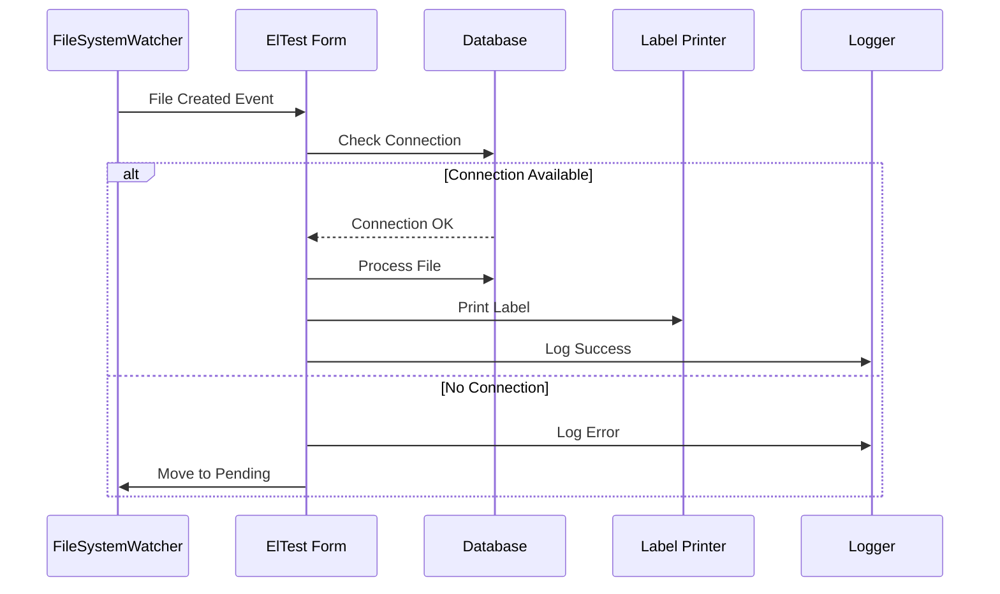

# Техническа Документация

## Архитектура на Системата

### Основни Компоненти

#### 1. ElTest Form (UI Layer)
- Основен интерфейс на приложението
- Управлява FileSystemWatcher инстанции
- Обработва потребителски интеракции
- Показва съобщения и статус

#### 2. File Processing System
- Следи множество директории за .txt файлове
- Обработва файлове асинхронно
- Поддържа опашка за pending операции
- Логва всички операции

#### 3. Database Layer
- Използва Entity Framework
- UnitOfWork pattern за транзакции
- Repository pattern за достъп до данни
- Поддържа множество контексти:
  - UretimOtomasyonContext
  - AmbarContext
  - NursandatabaseContext
  - PersonalContext

### Процес на Работа



## Критични Пътища и Оптимизация

### 1. Обработка на Файлове
```csharp
// Текущ подход
private void Watcher1_Created(object sender, FileSystemEventArgs e)
{
    // Синхронна обработка
    // Множество проверки на базата
    // Директна работа с файлове
}

// Препоръчан подход
private async Task Watcher1_CreatedAsync(object sender, FileSystemEventArgs e)
{
    // Асинхронна обработка
    // Connection pooling
    // Batch операции
}
```

### 2. Достъп до База Данни
```csharp
// Текущ подход
using (var context = new UretimOtomasyonContext())
{
    // Нов контекст за всяка операция
}

// Препоръчан подход
public class DatabaseService
{
    private readonly IDbContextFactory<UretimOtomasyonContext> _contextFactory;
    // Connection pooling и преизползване на контекст
}
```

### 3. Логване и Мониторинг
```csharp
// Текущ подход
private void LogOperation(string operation, string details)
{
    // Директно записване във файл
    // Без структурирано логване
}

// Препоръчан подход
public interface ILoggingService
{
    void LogOperation(LogLevel level, string operation, Dictionary<string, object> metadata);
    // Структурирано логване
    // Различни нива на логване
    // Ротация на логове
}
```

## Препоръки за Подобрение

### Краткосрочни Оптимизации

1. **File Processing**
```csharp
public class FileProcessor
{
    private readonly ConcurrentQueue<string> _pendingFiles;
    private readonly SemaphoreSlim _processingSemaphore;
    
    public async Task ProcessFileAsync(string filePath)
    {
        // Асинхронна обработка
        // Throttling
        // Retry логика
    }
}
```

2. **Database Access**
```csharp
public class DatabaseService
{
    private readonly IDbConnection _connection;
    private readonly IConnectionPool _pool;
    
    public async Task<bool> TryConnectWithRetryAsync()
    {
        // Retry политика
        // Connection pooling
        // Timeout handling
    }
}
```

### Средносрочни Подобрения

1. **Dependency Injection**
```csharp
public class Startup
{
    public void ConfigureServices(IServiceCollection services)
    {
        services.AddScoped<IFileProcessor, FileProcessor>();
        services.AddScoped<IDatabaseService, DatabaseService>();
        services.AddScoped<ILoggingService, LoggingService>();
    }
}
```

2. **Configuration Management**
```json
{
    "Directories": {
        "Watch": ["C:\\Kliptest", "C:\\Kliptest_2"],
        "Pending": "C:\\_Kliptest",
        "Labels": "C:\\Labels"
    },
    "Database": {
        "ConnectionString": "...",
        "RetryCount": 3,
        "RetryInterval": "00:00:05"
    }
}
```

## Мониторинг и Поддръжка

### Health Checks
```csharp
public class SystemHealthCheck
{
    public async Task<HealthCheckResult> CheckHealthAsync()
    {
        // Проверка на директории
        // Проверка на база данни
        // Проверка на принтер
        // Проверка на дисково пространство
    }
}
```

### Телеметрия
```csharp
public class TelemetryService
{
    public void TrackOperation(string operation, TimeSpan duration)
    {
        // Записване на метрики
        // Следене на производителност
        // Алармиране при проблеми
    }
}
```

## Сигурност

### Криптиране на Данни
```csharp
public class SecurityService
{
    public string EncryptSensitiveData(string data)
    {
        // Криптиране на чувствителни данни
        // Управление на ключове
        // Сигурно съхранение
    }
}
```

## Тестване

### Unit Tests
```csharp
public class FileProcessorTests
{
    [Fact]
    public async Task ProcessFile_WithValidData_ShouldSucceed()
    {
        // Arrange
        // Act
        // Assert
    }
}
```

### Integration Tests
```csharp
public class SystemIntegrationTests
{
    [Fact]
    public async Task CompleteFileProcessing_ShouldSucceed()
    {
        // End-to-end тест на системата
    }
} 